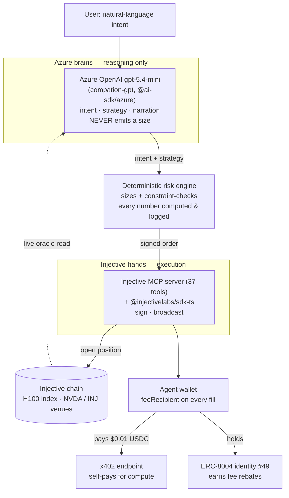

# Compation

> **Compation is an autonomous agent that hedges your AI compute costs on-chain — and pays for its own compute while it does.**

`testnet demo` · `Azure-powered` · `ERC-8004 #49` · `built on Injective`

### ▶ Live demo: **[compation.vercel.app](https://compation.vercel.app)**  ·  [demo script](docs/05_demo_script.md)

Compation turns a previously trader-only action — hedging the price of NVIDIA H100 GPU time — into a natural-language conversation. You tell it your exposure; it reasons about strategy with Azure OpenAI, sizes the position with a deterministic risk engine, and opens a **real, signed position on Injective**. Then it does something no demo does: it **pays for its own compute on-chain** via x402, and earns protocol fee rebates as a **registered ERC-8004 economic actor**. The architecture in one line: *Azure brains, Injective hands, an on-chain wallet that pays its own way.*

> **Trust principle:** The language model reasons; a deterministic risk engine sizes. Compation never hallucinates a position size — every number on screen is computed and constraint-checked, and every decision is logged.

---

## The problem

GPU rental prices — especially for the NVIDIA **H100** — are volatile and opaque, and they are the dominant cost for anyone training or serving AI.

A startup that budgets **$40,000/month for H100s** can watch that number balloon when demand spikes or supply tightens. Historically there has been **no financial instrument to hedge it**.

That just changed. Injective put the **first on-chain NVIDIA H100 rental-rate market** live (Squaretower / Stork oracle). Compute is becoming an asset class (CME / Silicon Data; Messari 2026 Theses). But a raw perpetual is unusable by a founder, and **no agent automates it**. Compation is that agent.

---

## What Compation does — the three wow moments

1. **Live execution.** A real signed position opens on Injective. The confirmation card shows the long position and a **real tx hash** you can click straight to the block explorer. *That's a real position on Injective, right now.*

2. **It pays for itself (x402).** Compation pays an x402 endpoint **$0.01 USDC** for the market-data/inference it used. The panel shows the on-chain settlement tx, an explorer link, and latency. *The agent just paid for its own compute, on-chain.*

3. **Real infrastructure (ERC-8004).** Compation holds an **ERC-8004 identity NFT** in Injective's on-chain registry, and its wallet is the **feeRecipient on every fill** — so it earns protocol fee rebates. *Compation isn't a demo — it's a registered economic actor with a built-in business model.*

---

## Architecture

*Azure brains, Injective hands, a wallet that pays its own way.* The language model decides **intent and strategy**; a **deterministic risk engine** decides **size**; the **Injective MCP server + sdk-ts** execute; the **wallet pays via x402 and earns fees**. Keys never touch the model.



### ASCII fallback

```
  User intent (natural language)
          |
          v
  +---------------------------+       Azure brains (reason only)
  | Azure OpenAI gpt-5.4-mini |  ---> intent + strategy + narration
  | "compation-gpt"           |       NEVER emits a position size
  +---------------------------+
          | intent + strategy
          v
  +---------------------------+       Deterministic risk engine
  | Risk engine: SIZES        |  ---> every number computed,
  | + constraint-checks       |       constraint-checked, logged
  +---------------------------+
          | signed order
          v
  +---------------------------+       Injective hands (execute)
  | MCP (37 tools) + sdk-ts   |  ---> sign + broadcast
  +---------------------------+
          |                 \
          v                  v
   Injective chain      Agent wallet (feeRecipient)
   (H100 idx,            |-- pays $0.01 USDC via x402  (pays its own way)
    NVDA/INJ venues)     |-- holds ERC-8004 #49        (earns fee rebates)
```

---

## The Injective integration

Every claim below is a verifiable on-chain artifact.

| Artifact | Identifier / detail |
|---|---|
| **H100 index** (the thing being hedged) | `H100/USDT PERP` · marketId `0x56cb0ef0b9d59125373112523b0adfc446dff989268547fa1a3379a6f98f5efd` · **PAUSED** (USDT→USDC collateral migration) · oracle `SQTWR_H100USD` via **Stork**, ~$2.85/H100-hour · index still **read key-lessly** for the live dashboard |
| **Headline trade venue** (proxy) | `NVDA/USDC PERP` · marketId `0xb9d9202c588e860382c96aee096f9655fce339f6b51833a939a37d2437080c17` · NVIDIA makes the H100 — thematically tight, active, deep book |
| **Fallback venue** | `INJ/USDC PERP` · marketId `0x790aee464fbbd02cf4476444554c71d1225f7edfe15e6dc7f874c455fd883d31` · deepest book |
| **Collateral** | USDC · trades execute from the **default subaccount**, drawing on the bank balance |
| **Execution** | `@injectivelabs/sdk-ts` for signing/broadcast (the live path); the **Injective MCP server (37 tools)** is integrated for tool discovery — an MCP execution path is scaffolded for future use |
| **x402 self-payment** | `https://agents.injective.com/api/x402/perps/market-data` · pays **0.01 USDC** on Injective EVM (chain `1439`, `eip155:1439`) via **EIP-3009 gasless USDC** (Circle FiatTokenV2_2); Injective's facilitator settles on testnet · panel shows tx hash + explorer link + latency |
| **ERC-8004 identity** | **Identity NFT #49** — registry (testnet) `0x8004A818BFB912233c491871b3d84c89A494BD9e`, (mainnet) `0x8004A169FB4a3325136EB29fA0ceB6D2e539a432` · registration tx confirmed at block `131740980` → [**view on Blockscout**](https://testnet.blockscout.injective.network/tx/0x0c96c4816f814e77d699ce9f00800c95d7d64abafcc5a3f250f3f3278452aea0) |
| **Agent wallet** | `inj1t4a8x0fs2949c4x3lfsqzw7tnl7fyf0jdeyu7v` · EVM `0x5d7a733D30516A5c54d1FA60013bCB9ffc9225f2` · **feeRecipient on every order** → earns protocol fee rebates |

---

## Azure usage

The runtime brain is **Azure OpenAI `gpt-5.4-mini`**, deployed as deployment name **`compation-gpt`**, accessed via **`@ai-sdk/azure`** and the Vercel AI SDK (`streamText` / `generateText` / tool-calling). It's shown in the app header.

**What Azure does:** intent recognition, strategy selection, and plain-language narration of what the agent is about to do and why.

**What Azure does NOT do:** it **never emits a position size**. Sizing is owned entirely by the deterministic risk engine. This is the core of the trust model — the model reasons, the engine sizes.

---

## How to run

```bash
# 1. Configure environment
cp .env.example .env
#    Fill: Azure OpenAI creds + the agent's INJECTIVE_PRIVATE_KEY / INJECTIVE_WALLET_ADDRESS
#    Preset: X402_ENDPOINT, ERC8004_TOKEN_ID=49, ERC8004_TX_HASH

# 2. Install (pnpm workspaces)
pnpm install

# 3. Database (Prisma / SQLite at apps/agent/prisma/dev.db)
pnpm --filter @compation/agent exec prisma db push

# 4. Run the app -> http://localhost:3000
pnpm --filter @compation/web dev

# Reset between demos (clears decision-trail rows; preserves identity #49)
pnpm --filter @compation/agent demo:reset
```

**Executor modes:**
- `EXECUTOR=fake` — the **safe dev default** (no on-chain writes).
- `EXECUTOR=sdk` — runs **real testnet trades**.
- Mainnet writes are **hard-gated** behind `ALLOW_MAINNET_WRITES=true`.

**Faucets:** testnet INJ from the Injective faucet; testnet USDC for x402.

---

## Repo layout

```
compation/
├── apps/
│   ├── web/        Next.js 16 + React 19 + Tailwind v4 — dark finance UI
│   │               (chat · decision trail · hedge confirmation ·
│   │                live hedge dashboard + what-if simulator ·
│   │                x402 panel · identity badge)
│   └── agent/      orchestrator (assess_exposure -> compute_hedge ->
│                   place_hedge -> summarize) · deterministic risk engine ·
│                   injective executor (fake | sdk) · x402 payer ·
│                   ERC-8004 identity · Prisma/SQLite persistence
├── packages/
│   └── shared/     markets registry + routes
├── infra/
│   └── mcp/        the Injective MCP server
└── docs/           demo script + supporting docs
```

**Stack:** TypeScript end-to-end, pnpm workspaces.
**Tests:** **67 agent unit tests** (risk engine 33, decimal scaling 13, error-normalizer 8, orchestrator 8, what-if 5).

---

## Demo

**▶ Live (hosted):** https://compation.vercel.app — runs real **testnet** execution (`EXECUTOR=sdk`); x402 settlement and the ERC-8004 #49 identity are real on-chain.
**Demo video:** _<link to be added>_

Step-by-step walkthrough: [`docs/05_demo_script.md`](docs/05_demo_script.md)

---

## How this maps to the 5 judging criteria

| Criterion | How Compation meets it |
|---|---|
| **Innovation** | Among the first AI agents on the on-chain H100 compute-derivative market; assembles H100 hedging + ERC-8004 identity + x402 self-payment — a combination we haven't seen built before. |
| **Technical implementation** | Real on-chain execution via `@injectivelabs/sdk-ts` (MCP integrated); deterministic risk engine; ERC-8004 identity; x402 settlement; 67 unit tests. |
| **Application value** | Hedges the largest cost for every AI company; clear ICP (AI startups renting H100s); built-in monetization via fee rebates + x402. |
| **Product experience** | Natural-language intake, plain-language confirmations, a transparent decision trail, and a what-if simulator — AI lowers the barrier to a previously trader-only action. |
| **Ecological compatibility** | A registered Injective economic actor (ERC-8004) earning protocol fees; uses Injective + Microsoft Azure end-to-end; clear incubation / expansion path. |

---

## Disclaimer

Compation is **non-custodial** — keys never touch the model. It is **tooling that executes the user's stated intent**, not a custodian or investment adviser. **Nothing here is financial advice.**

---

## Known limitations

- The **H100 perp is paused** for a USDT→USDC collateral migration, so the tradeable hedge uses the **NVDA/USDC proxy** while the real H100 index is still **read live** from the Stork oracle.
- **Testnet order books are thin** — a close can occasionally fail to fill.
- The demo runs **testnet-only by choice** for reliability; the mainnet write path exists and is **hard-gated** behind `ALLOW_MAINNET_WRITES=true`.
- The **hosted demo** (`compation.vercel.app`) runs the **real testnet executor** from a minimally-funded agent wallet, so anyone can open a small testnet position — thin testnet books can make a fill lag. Persistence (Prisma/SQLite) is local-only; the hosted decision trail renders from the live stream.
